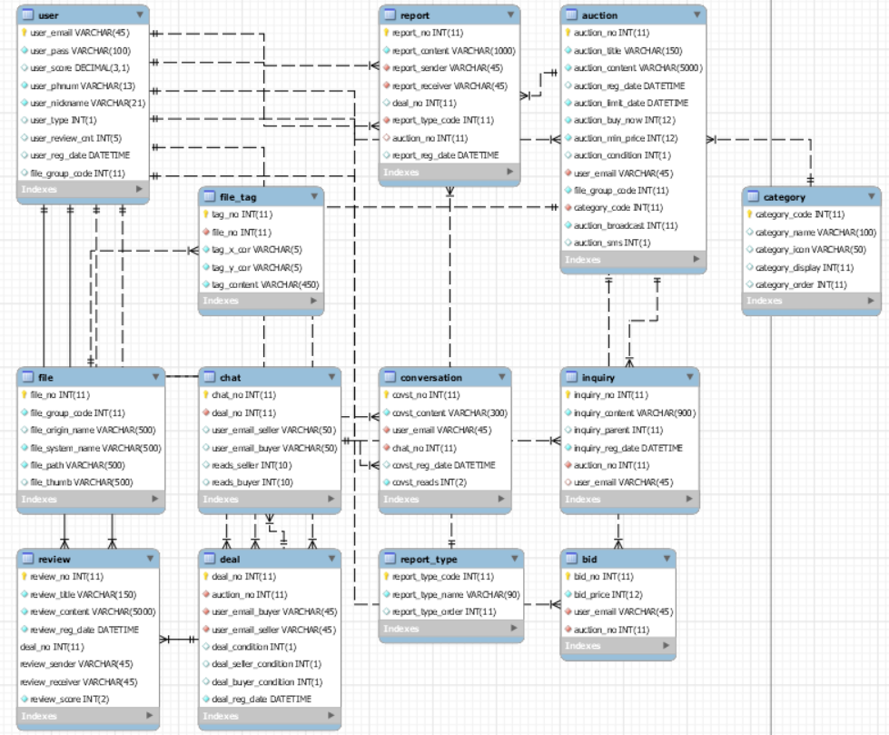
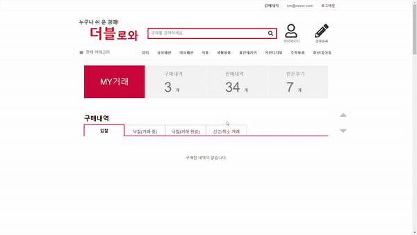
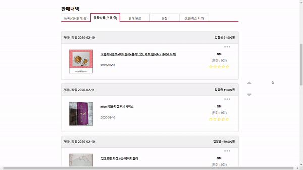
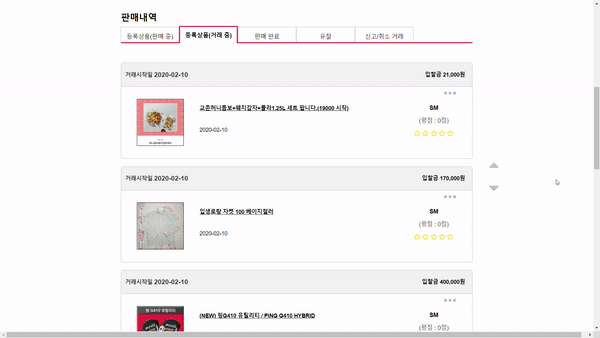
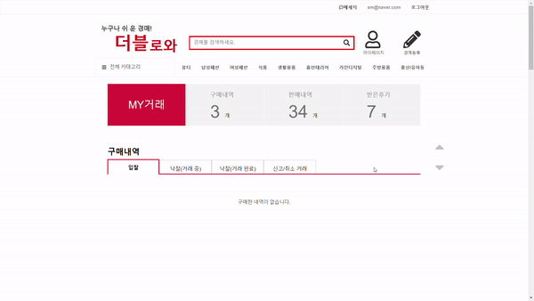

# 실시간 중고 경매 사이트

## 개요

사용자가 중고물품을 경매형식으로 판매, 구매하고 실시간으로 물건상태를 확인하며 거래할 수 있는 사이트입니다.

## 주요기술

* JAVA, Spring
* HTML, CSS, BootStrap, JavaScript, jQuery
* MySQL

## 사용 협업 Tool

* GitHub, Source Tree, Trello

## ERD

## 나의 구현 기능

### 거래 내역/후기

* 판매내역 - 등록, 거래 중, 거래완료, 거래 취소/신고, 유찰 분류
* 구매내역 - 입찰, 거래 중, 거래완료, 거래 취소/신고 분류
* 후기 - 등록, 수정, 삭제, 별점, 무한페이징

## 거래내역

### 판매내역

### 거래내역

### 거래완료

### 거래 신고/취소

## 후기

### 후기목록

### 후기등록

### 후기수정

### 후기삭제

